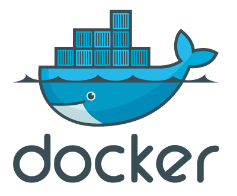

# Install-docker--for-mac

#  Install Docker Desktop on Mac!

Hello, in this document I help you to install easily docker on your Mac M2.

# 1
Download the installer using the download buttons at the top of the page, or from the  [release notes](https://docs.docker.com/desktop/release-notes/).

# 2
 Double-click  `Docker.dmg`  to open the installer, then drag the Docker icon to the  **Applications**  folder. By default, Docker Desktop is installed at  `/Applications/Docker.app`.

 # 3
Double-click  `Docker.app`  in the  **Applications**  folder to start Docker.

# 4
The Docker menu displays the Docker Subscription Service Agreement.

**Here’s a summary of the key points:**

-   Docker Desktop is free for small businesses (fewer than 250 employees AND less than $10 million in annual revenue), personal use, education, and non-commercial open source projects.
-   Otherwise, it requires a paid subscription for professional use.
-   Paid subscriptions are also required for government entities.
-   Docker Pro, Team, and Business subscriptions include commercial use of Docker Desktop.

  # 5
Select **Accept** to continue.

**Note** *that Docker Desktop won't run if you do not agree to the terms. You can choose to accept the terms at a later date by opening Docker Desktop.*

resources: https://docs.docker.com/desktop/install/mac-install/
